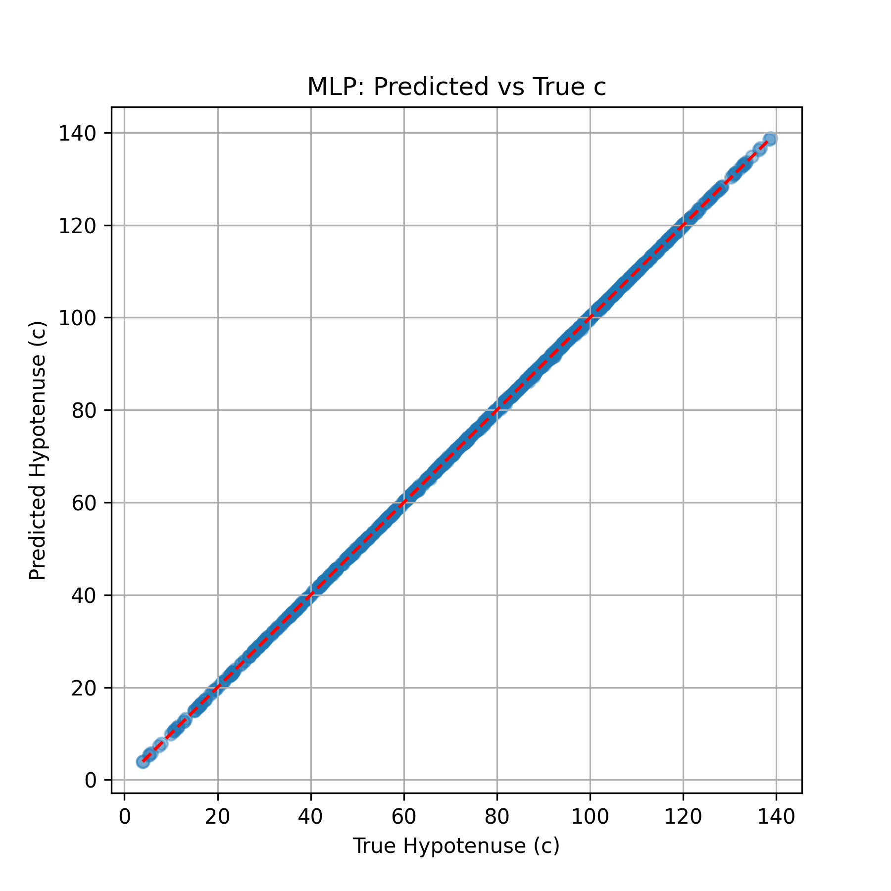
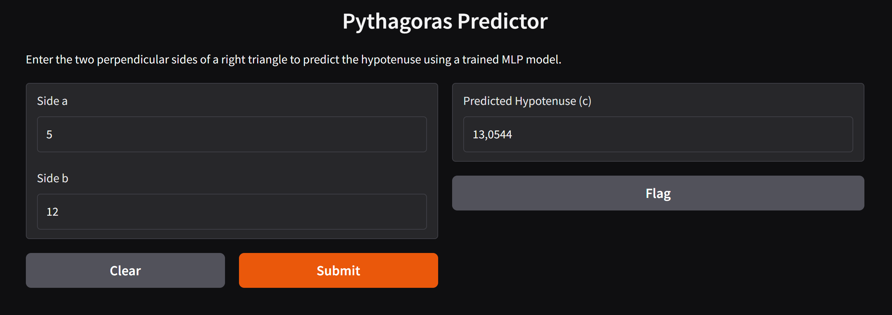

# Predicting the Hypotenuse with Shallow Learning

This project uses machine learning to predict the hypotenuse (c) of a right-angled triangle using sides a and b, based on Pythagoras' Theorem. It's part of the **Software III - MRAC01** course.

---

## Objective

### 1 - Approximate the mathematical formula
\[
c = \sqrt{a^2 + b^2}
\]

using shallow machine learning.


### 2 - Compare Linear Regression with MLP Regressor

Pythagoras' Theorem is nonlinear due to the square root function.

The comparison showed that:

Linear Regression:
- Linear Regression can only model straight-line relationships between input and output.
- As a result, it tries to approximate the curved function with a flat plane, leading to higher error.

MLP Regressor:
- The MLP Regressor (Multi-Layer Perceptron) is a type of neural network that can model complex, nonlinear relationships.
- It learns the curvature of the √(a² + b²) function more effectively.
- This results in very low MSE and perfect R², meaning it captured the relationship almost perfectly.


---

## Folder Structure

```
pythagoras/
├── data/
│   └── triangle_dataset.csv         # Generated dataset
├── models/
│   ├── linear_regression_model.pkl  # Trained Linear Regression 
│   └── mlp_model.pkl                # Trained MLPRegressor 
├── results/
│   ├── pred_vs_true_01.png          # Visualization of predictions after linear regression training
│   └── pred_vs_true_mlp.png         # Vizualisation of predictions after mlpregressor training
├── src/                            
│   ├── generate_dataset.py          # Create synthetic dataset for triangle_dataset.csv 
│   ├── train.py                     # Train Linear Regression
│   ├── evaluate.py                  # Evaluate and visualize predictions of Linear Regression
│   ├── mlp_train.py                 # Train mlpregressor
│   └── mlp_evaluate.py              # Evaluate and visualize predictions of mlpregressor
├── requirements.txt                 # Python dependencies
└── README.md                        
```

---

## Installation

Install required packages:

```bash
pip install -r requirements.txt
```

---

## Workflow

### 1. Generate Dataset

```bash
python src/generate_dataset.py
```

Creates `data/triangle_dataset.csv` with random side lengths and computed hypotenuse.

---

### 2. Train Model

```bash
python src/train_model.py
```

Trains a Linear Regression model and saves it to `models/linear_regression_model.pkl`.

---

### 3. Evaluate Model

```bash
python src/evaluate_model.py
```

Prints metrics and saves the prediction plot to `results/pred_vs_true.png`.

---

## Results

### Linear Regression
| Metric | Value  |
|--------|------------------|
| MSE    | 36.2317          |
| R²     | 0.9567          |


### MLP Regressor
| Metric | Value   |
|--------|---------|
| MSE    | 0.0213  |
| R²     | 1.0000  |


---

### Prediction Plot

**Linear Regression**


**MLP Regressor**




MSE (Mean Squared Error) - Average of the squares of the prediction errors — how far off the predictions are from the real values. Lower is better.

R² (R-squared Score) - Measures how well the model explains the variance in the data. 1.0 is perfect prediction.

---

### Usage of trained model - Live Demo

## Live Demo

The mlp model is deployed using Gradio. Input sides `a` and `b` to get the predicted hypotenuse `c`.

```bash
python src/app.py
```




### Authors
[Aleksandra Kraeva](https://github.com/sashakraeva)

Acknowledgements
- [Marita Georganta](https://www.linkedin.com/in/marita-georganta/) - Robotic Sensing Expert

